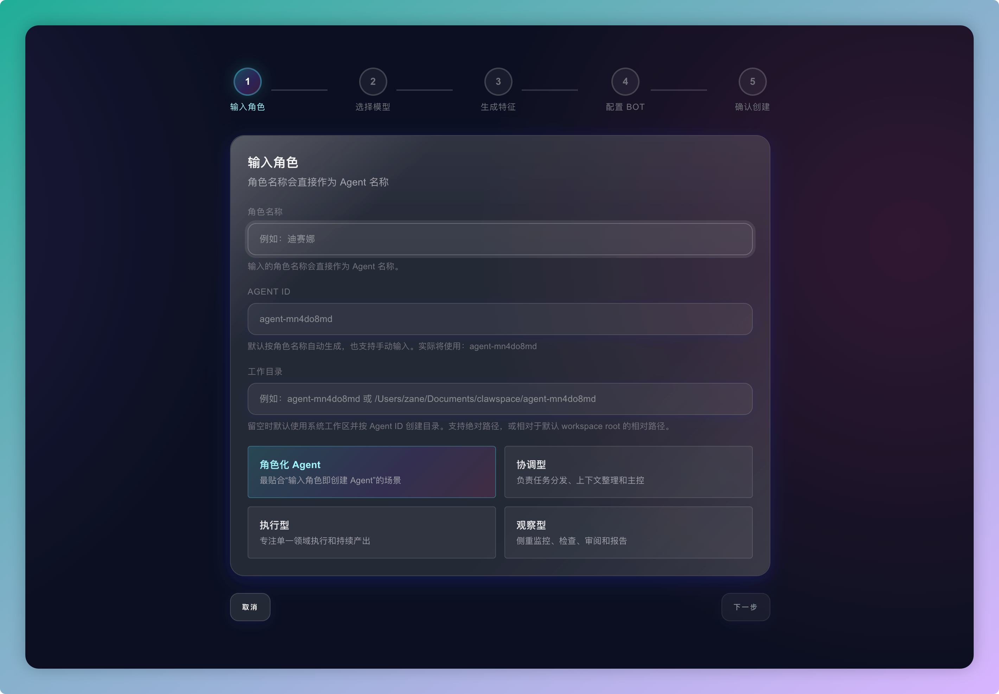
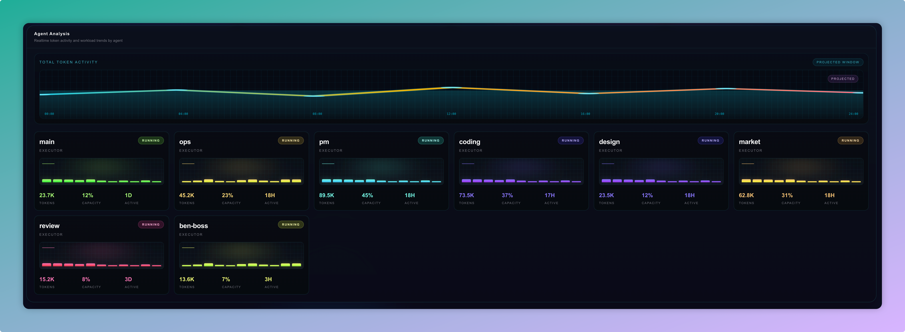
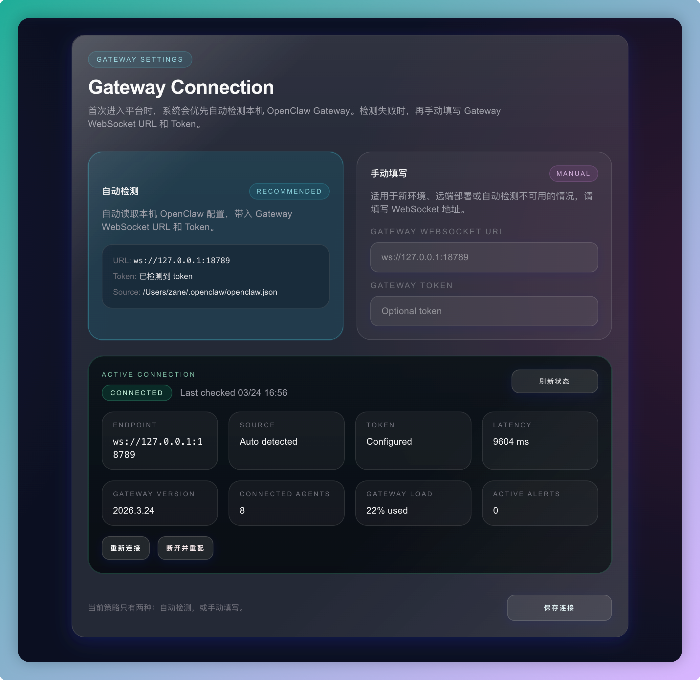

# ClawLab

ClawLab is a web console for OpenClaw Gateway. It provides a UI for connecting to a gateway, monitoring runtime status, managing agents, and checking agent-to-bot bindings.

## Features

- Connect to a local or remote OpenClaw Gateway
- Auto-detect local gateway configuration on first launch
- Manually configure Gateway WebSocket URL and token
- View dashboard metrics and runtime overview
- List and manage agents
- Create new agents through a guided flow
- Inspect model selection, bot bindings, status, and token usage

## Screenshots

### Dashboard

System overview and gateway runtime status.


### Agents

Agent list and management view.



### Analysis

Agent analysis and runtime trends.



### Settings

Gateway connection setup and maintenance.



## Routes

- `/`
  - Dashboard overview
- `/agents`
  - Agent list and management
- `/agents/new`
  - New agent wizard
- `/settings`
  - Gateway connection settings
- `/onboarding`
  - First-time gateway setup

## Requirements

- Node.js 20 or newer
- npm 10 or newer
- A running OpenClaw Gateway instance

Recommended:

- A local OpenClaw configuration so ClawLab can auto-detect gateway settings
- Valid Gateway WebSocket URL and token for manual setup

## Getting Started

### Install dependencies

```bash
npm install
```

### Run in development

```bash
npm run dev
```

Open:

```bash
http://localhost:3000
```

### Production build

```bash
npm run build
npm run start
```

## Configuration

ClawLab connects to OpenClaw Gateway through one of two modes:

- Auto-detect
  - Reads local OpenClaw configuration when available
- Manual
  - Uses a user-provided Gateway WebSocket URL and token

If the app cannot detect a local config, open `/onboarding` or `/settings` and enter the gateway connection details manually.

## Usage

### Connect a gateway

1. Start OpenClaw Gateway.
2. Open ClawLab.
3. Let the app auto-detect the local gateway config if available.
4. If auto-detection fails, enter the Gateway WebSocket URL and token manually.
5. Save the connection and continue to the dashboard.

### View agents

1. Open `/agents`.
2. Review agent details including:
   - ID
   - Name
   - Role
   - Model
   - Bot binding
   - Status
   - Token usage

### Create an agent

1. Open `/agents/new`.
2. Complete the wizard:
   - Basic agent info
   - Model selection
   - Persona configuration
   - Boot / access configuration
3. Submit and wait for gateway hot reload sync.

### Adjust gateway settings

1. Open `/settings`.
2. Use the page to:
   - Refresh connection state
   - Reconnect gateway
   - Disconnect current gateway
   - Switch between auto-detect and manual configuration

## Tech Stack

- Next.js 16
- React 19
- TypeScript
- Tailwind CSS 4

## Project Structure

```text
app/
  page.tsx                Dashboard
  agents/                 Agent list and create pages
  settings/               Gateway settings
  onboarding/             First-time setup flow
  api/                    Server routes

components/
  agents/                 Agent list and creation UI
  dashboard/              Dashboard widgets
  settings/               Gateway connection UI
  ui/                     Shared UI components

lib/
  gateway.ts              Client-side gateway API wrappers
  gateway-server.ts       Server-side gateway reads
  gateway-connection.ts   Connection state and config helpers
  types.ts                Shared types

images/
  claws.png               Dashboard screenshot
  agent.png               Agents screenshot
  analysis.png            Analysis screenshot
  setting.png             Settings screenshot
```

## Notes

- ClawLab depends on a running OpenClaw Gateway for live data.
- Build-time warnings related to OpenClaw plugin discovery may not block the frontend build, but should still be reviewed before deployment.

## Troubleshooting

### Gateway cannot be detected

- Make sure OpenClaw Gateway is running
- Check that the local OpenClaw config exists and is readable
- Switch to manual mode and enter the WebSocket URL and token directly

### Agent list is empty

- Confirm the gateway is connected
- Check whether the gateway currently has registered agents
- Refresh the connection state from `/settings`

### Build warnings mention plugin discovery

- This project may surface warnings from OpenClaw plugin scanning during build
- These warnings do not always block the frontend build
- Review your OpenClaw plugin allowlist and local gateway/plugin setup before production deployment

### Dashboard has no live data

- Verify that Gateway is reachable from ClawLab
- Confirm the Gateway token is valid if authentication is enabled
- Reconnect from `/settings` and refresh the dashboard
